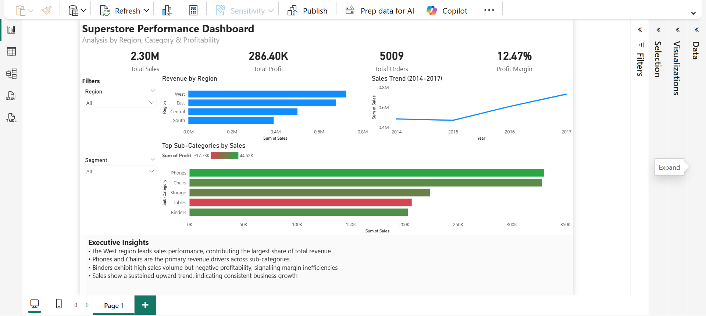

# Superstore Sales Analysis

## Project Overview

This project analyzes retail sales data from the Superstore dataset to uncover business insights related to sales performance, profitability, customer behavior, and regional trends. Using Python for data analysis and Power BI for visualization, the project transforms raw transactional data into actionable insights that support data-driven decision-making.

## Objectives

- Analyze overall sales and profit performance
- Identify top-performing products and categories
- Evaluate regional sales and profitability trends
- Understand customer purchasing behavior
- Develop interactive dashboards to communicate insights effectively
- Generate business recommendations based on data findings

## Tools & Technologies

- Python
- Pandas
- Matplotlib
- Jupyter Notebook
- Power BI
- Microsoft Excel

## Dataset

The Sample Superstore dataset contains retail transaction data including:

- Orders
- Customers
- Products
- Categories and Sub-Categories
- Sales
- Profit
- Regions
- Shipping Information
- Customer Segments

**Dataset Source:** Sample Superstore Dataset

## Key Insights

- The West region emerged as the highest-performing market by sales revenue
- Phones and Chairs were the strongest revenue-generating sub-categories
- Certain products generated strong sales volumes but low profitability, highlighting margin improvement opportunities
- Sales performance demonstrated consistent growth over time
- Customer purchasing patterns revealed opportunities for targeted marketing strategies

## Dashboard Preview



## Project Files

```text
├── analysis.ipynb
├── Sample-Superstore.csv
├── Superstore_dashboard.png
└── README.md
```

## How to Run

1. Download or clone the repository
2. Install the required libraries:

```bash
pip install pandas matplotlib
```

3. Open Jupyter Notebook
4. Run all cells in `analysis.ipynb`

## Skills Demonstrated

- Data Cleaning
- Exploratory Data Analysis (EDA)
- Business Intelligence
- Data Visualization
- Dashboard Development
- KPI Design
- Python Programming
- Power BI Reporting
- Business Insights Generation

## Business Impact

This project demonstrates how sales data can be transformed into actionable insights to support strategic decision-making, performance monitoring, and business growth.

## Author

**Tosin Bolanle**

Data Analytics Portfolio Project
